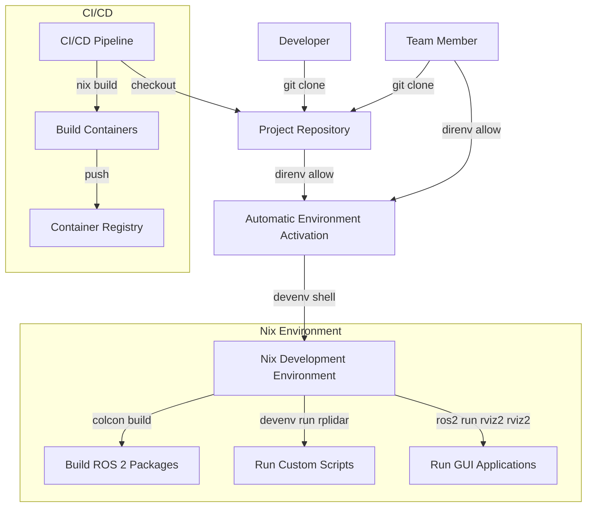

Sound familiar?

* Spending hours debugging why `colcon build` fails on a teammate's machine, on your robot (or worse, in CI)?
* Hesitating to upgrade your OS because it might break your ROS setup?
* Dealing with slow Docker builds and awkward workarounds for GUI tools like RViz or Gazebo?
* Constantly cleaning caches and rebuilding everything from scratch?
* Worrying that your robot's machine may not match your development environment?

There's a better way. Imagine a ROS 2 development environment, that is:

* **Perfectly Reproducible:** Every developer and your CI server gets the *exact* same environment, every single time.
* **Distro Independent:** Develop on Fedora, Arch, macOS, NixOS, or even WSL2 on Windows, without changing your setup.
* **Fast:** Leverage powerful caching to avoid rebuilding dependencies constantly. Enter your project and be ready to code in seconds.
* **Ergonomic:** Simple commands, automatic activation, and clear configuration.
* **Flexible:** Easily mix ROS packages with thousands of other tools, add custom packages, and manage everything declaratively.

This isn't a fantasy. It's achievable *today* by combining the power of the **Nix package manager**, the **`nix-ros-overlay`**, and the developer-friendly **`devenv.sh`**.

## The Problem with Traditional ROS 2 Development

Before diving into the solution, let's understand why ROS 2 development can be frustrating:

1. **OS Dependency Trap:** ROS 2 distributions are tightly coupled to specific Ubuntu versions. Want to use ROS 2 Humble? You need Ubuntu 22.04. Prefer a different Linux distro? Good luck.

2. **Dependency Hell:** ROS packages often have complex dependency trees that can conflict with system packages or other ROS workspaces. One wrong version can break everything.

3. **"Works on My Machine" Syndrome:** You've heard it before: "But it works on my machine!" Different system configurations lead to inconsistent behavior across development, testing, and deployment.

4. **Docker Limitations:** While Docker provides isolation, it comes with overhead and challenges for GUI applications like RViz and Gazebo, which are essential for robotics development.

5. **Slow Rebuilds:** Traditional ROS workflows can involve rebuilding large portions of your workspace when only a small part has changed.

## The Magic Ingredients

Our solution combines four powerful technologies:

### 1. Nix: The Foundation of Reproducibility

[Nix](https://nixos.org/nix/) is a package manager and build system unlike any other. Its key principle is *determinism*. It builds packages in isolation, tracks dependencies precisely, and ensures that if something builds once, it will build identically anywhere, anytime.

Think of Nix as a "build system on steroids" that creates a perfect, isolated environment for each package. Unlike traditional package managers that install software into shared directories like `/usr/bin`, Nix stores each package in its own unique location in the `/nix/store`, eliminating dependency conflicts.

### 2. nix-ros-overlay: The Bridge to ROS

[nix-ros-overlay](https://github.com/lopsided98/nix-ros-overlay) acts as a bridge, making ROS packages available within the Nix ecosystem. It automatically generates Nix package definitions from ROS distributions and provides a [binary cache](https://hydra.iid.ciirc.cvut.cz/project/nix-ros-overlay) so you often don't even need to build ROS packages from source!

This project is the secret sauce that makes ROS development with Nix practical, providing access to thousands of ROS packages across different distributions.

### 3. devenv.sh: Developer Experience Made Simple

While Nix is powerful, its raw language can have a learning curve. [devenv.sh](https://devenv.sh/) provides a much simpler, declarative interface specifically for creating developer environments. It manages Nix complexity, integrates seamlessly with tools like `direnv`, and offers features like defining custom scripts, managing background processes, and composing environments.

### 4. direnv: Automatic Environment Activation

[direnv](https://direnv.net/) automatically loads and unloads environment variables (and activates your `devenv` shell) based on your current directory. `cd` into your project, and *boom*, your ROS 2 environment is ready. `cd` out, and it's gone.

## Building Your Ergonomic ROS 2 Haven

Let's look at how these pieces fit together to create a seamless ROS 2 development environment.

### 1. Defining Inputs (`devenv.yaml`)

This file tells `devenv` where to get its core components (Nix "flakes"):

```yaml [devenv.yaml]
inputs:
  # Utility for devenv scripts
  mk-shell-bin:
    url: github:rrbutani/nix-mk-shell-bin
  # The star of the show: provides ROS packages
  nix-ros-overlay:
    url: github:lopsided98/nix-ros-overlay/master # Or 'develop' for bleeding edge
  # For potential container builds (optional for dev)
  nix2container:
    url: github:nlewo/nix2container
    inputs:
      nixpkgs:
        follows: nixpkgs # Ensures nix2container uses the same nixpkgs
  # Essential for running GUI apps like RViz/Gazebo outside NixOS
  nixgl:
    url: github:nix-community/nixGL/main
  # The base Nix package set - CRUCIAL: Must follow nix-ros-overlay's version!
  nixpkgs:
    follows: nix-ros-overlay/nixpkgs
# Allow non-free packages if needed (e.g., some drivers, CUDA)
allowUnfree: true
```

The critical part here is `nixpkgs: follows: nix-ros-overlay/nixpkgs`, which ensures our base package set is the *exact* version that `nix-ros-overlay` was built and tested against, preventing compatibility issues.

### 2. Configuring the Environment (`devenv.nix`)

This is where you define the specifics of *your* development shell:

::code-collapse

```nix [devenv.nix]
{
  pkgs,        # The Nix package set (derived from inputs.nixpkgs)
  lib,         # Nixpkgs utility functions
  config,      # devenv configuration values
  nixpkgs,     # Direct access to the nixpkgs input
  nix-ros-overlay, # Direct access to the overlay input
  nixgl,       # Direct access to the nixgl input
  ...
}:

let
  # Import custom package definitions (see vendor section below)
  vendor = import ./vendor;
  # Helper for nixGL configuration
  isIntelX86Platform = pkgs.stdenv.system == "x86_64-linux";
  nixGL = import nixgl {
    inherit pkgs;
    enable32bits = isIntelX86Platform;
    enableIntelX86Extensions = isIntelX86Platform;
  };
in
{
  # A name for your environment
  name = "ros-devenv-example"; # Replace with your project name

  # Configure Cachix binary caches for faster builds
  cachix.pull = [ "ros" ]; # Pull pre-built ROS packages
  # cachix.push = "your-cache-name"; # Optional: Push your builds to a private cache

  # Apply overlays to the base package set
  overlays = [
    nix-ros-overlay.overlays.default # Makes ROS packages available via pkgs.rosPackages...
    vendor                          # Adds our custom packages (see vendor section)
  ];

  # --- Packages ---
  # List the packages needed in the development shell
  packages =
    with pkgs; # Allows writing 'git' instead of 'pkgs.git'
    [
      # Essential dev tools
      git
      colcon # The ROS 2 build tool
      graphviz # Often needed for ROS visualization tools
      cairo    # Dependency for some GUI libraries

      # --- Select ONE nixGL variant based on your GPU ---
      # Provides OpenGL support for GUI apps outside NixOS
      # Choose the one appropriate for your hardware/driver setup
      nixGL.auto.nixGLDefault # Often works
      # nixGL.nixGLIntel
      # nixGL.auto.nixGLNvidia
      # ... other variants
    ]
    # Add ROS 2 Humble packages
    ++ (with pkgs.rosPackages.humble; [ # Or change 'humble' to 'jazzy', 'noetic', etc.
      # --- ROS 2 Packages ---
      # Use buildEnv to group ROS packages and ensure their setup.sh is sourced
      (buildEnv {
        name = "ros-env"; # Name for this specific ROS package group
        paths = [
          # Core ROS libraries
          ros-core
          ament-cmake-core

          # Specific ROS packages for your project
          rplidar-ros # From our custom vendor overlay
          rviz2       # For visualization
          nav2-amcl   # Navigation stack component
          slam-toolbox # SLAM algorithms
          tf2-ros     # Transform library
          tf2-tools   # TF debugging tools
          rqt-common-plugins # Useful RQT GUI tools
          rqt-tf-tree # RQT TF visualization
        ];
      })
    ]);

  # --- Scripts ---
  # Define reusable shell commands available inside the environment
  scripts.rplidar = {
    # Example: Launch RPLidar node with arguments
    # Usage: devenv run rplidar /dev/ttyUSB0 lidar_frame scan
    # Args: $1=serial_port, $2=frame_id, $3=scan_topic
    exec = ''
      echo "Launching RPLidar on $1 (Frame: $2, Topic: $3)..."
      # Note: ros2 run commands work directly because buildEnv sourced setup.sh
      ros2 run rplidar_ros rplidar_node --ros-args \
        -p serial_port:=$1 \
        -p serial_baudrate:=460800 \
        -p frame_id:=$2 \
        -p inverted:=false \
        -p angle_compensate:=true \
        -p scan_frequency:=10.0 \
        -p scan_mode:=Standard \
        --remap scan:=$3
    '';
  };

  containers.rplidar = {
    name = "rplidar";
    startupCommand = config.scripts.rplidar.exec;
  };

  # --- Git Hooks ---
  # Automatically run checks/formatters on commit
  git-hooks.hooks = {
    shellcheck.enable = true; # Check shell scripts
    # mdsh.enable = true; # Example: Check markdown
    flake-checker.enable = true; # Check Nix code health
    nixfmt-rfc-style.enable = true; # Format Nix code
    actionlint.enable = true; # Lint GitHub Actions workflows
  };
}
```

::

Let's break down the key elements:

- **`overlays`:** This is where `nix-ros-overlay` is activated, making `pkgs.rosPackages.humble` (or other distros) available. We also add our `vendor` overlay for custom packages.
- **`packages`:** We list standard tools (`git`, `colcon`) and crucially, the ROS packages.
- **`buildEnv`:** This groups ROS packages and ensures their environment (`setup.sh`) is correctly sourced when you enter the shell, so commands like `ros2 run` just work.
- **`nixGL`:** Added to enable GUI tools like RViz and Gazebo. *Remember to uncomment the correct variant for your GPU.*
- **`scripts`:** Define handy shortcuts like `devenv run rplidar ...` for common tasks.
- **`cachix`:** Pulling from the `ros` cache dramatically speeds up setup by downloading pre-built binaries.

### 3. Adding Custom/Patched Packages (`vendor/`)

Need a ROS package not yet in `nix-ros-overlay`, or need to apply a patch? No problem. Here's how to add the RPLidar ROS package:

```nix [vendor/default.nix]
# This file defines the 'vendor' overlay
self: super: {
  # Add our custom rplidar-ros package definition
  rplidar-ros = self.callPackage ./rplidar-ros;
  # Add other custom packages here...
}
```

::code-collapse

```nix [vendor/rplidar-ros/default.nix]
# Defines how to build the rplidar-ros package using Nix
{
  lib,             # Nix utility functions
  buildRosPackage, # Helper from nix-ros-overlay for building ROS packages
  fetchFromGitHub, # Nix function to fetch source code
  # ROS dependencies (these come from nix-ros-overlay via pkgs)
  ament-cmake,
  rclcpp,
  sensor-msgs,
  std-srvs,
}:

buildRosPackage {
  pname = "rplidar-ros"; # Package name

  # Fetch the specific source code version
  src = fetchFromGitHub {
    owner = "Slamtec";
    repo = "rplidar_ros";
    rev = "3cd94febf0ad7710a3115d57f6063a0c8f6f5bb2"; # Pinned commit hash
    # Nix calculates the sha256 hash automatically on the first build
    # or you can pre-fetch it using 'nix-prefetch-git'
    # $ nix-prefetch-url --unpack https://github.com/Slamtec/rplidar_ros/archive/3cd94febf0ad7710a3115d57f6063a0c8f6f5bb2.tar.gz
    hash = "sha256-00ybjy3jjsrj64r6xqhxkrab12p4hmmabzikhq9266dcsajbbial=";
  };

  buildType = "ament_cmake"; # Standard ROS 2 build type

  # Propagated dependencies (available at runtime)
  buildInputs = [
    rclcpp
    sensor-msgs
    std-srvs
  ];
  # Build-time only dependencies
  nativeBuildInputs = [ ament-cmake ];

  # Metadata
  meta = {
    description = "RPLIDAR ROS package";
    license = lib.licenses.bsd2; # Use Nix's license identifiers
    homepage = "https://github.com/Slamtec/rplidar_ros";
  };
}
```

::

This `vendor` overlay demonstrates how easily you can integrate packages directly from source, pinning them to specific commits for reproducibility. `buildRosPackage` handles the ROS-specific build steps.

### 4. Automatic Activation (`.envrc`)

This tiny file is the key to ergonomic activation:

```bash [.envrc] {icon="i-mdi-file-code"}
#!/bin/bash

export DIRENV_WARN_TIMEOUT=20s

eval "$(devenv direnvrc)"

# The use_devenv function supports passing flags to the devenv command
# For example: use devenv --impure --option services.postgres.enable:bool true
use devenv
```

With `direnv` installed and hooked into your shell, simply `cd` into your project directory. `direnv` will detect `.envrc`, ask for permission the first time (`direnv allow .`), and then automatically build (if needed) and activate your complete ROS 2 development environment!

## The Workflow in Action

Let's see how this setup transforms your daily development workflow:



### The Payoff: A Superior Developer Experience

What does this setup give you?

1. **Onboarding Nirvana:** New team member? `git clone`, `direnv allow .`, `colcon build`. Done. No OS setup, no dependency hunting.

2. **CI Consistency:** Your CI pipeline uses the exact same Nix definitions. If it builds locally, it builds in CI.

3. **Freedom to Explore:** Try the latest ROS `jazzy` alongside `humble` in different projects without conflicts. Run it all on your preferred Linux distro.

4. **Blazing Speed:** Once dependencies are built and cached (either locally or via Cachix), entering the environment (`cd my-project`) takes seconds. `colcon build` only rebuilds *your* code.

5. **Clean System:** No ROS libraries cluttering your global `/usr/lib` or Python environments. Everything is self-contained per project.

6. **Native Performance:** No Docker overhead for development. GUI tools like RViz work seamlessly (thanks to `nixGL`).

## CI/CD Integration

Here's an example GitHub Action for building containers using this setup:

::code-collapse

```yaml [.github/workflows/publish.yml]
name: Publish Container

on:
  push:

env:
  CACHIX_AUTH_TOKEN: ${{ secrets.CACHIX_AUTH_TOKEN }}

permissions:
  contents: read
  packages: write

jobs:
  build-containers:
    name: Build ${{ matrix.container }} Container
    runs-on: ubuntu-latest
    strategy:
      fail-fast: false
      matrix:
        container: ["rplidar"]

    steps:
      - name: Checkout code
        uses: actions/checkout@v4
        with:
          fetch-depth: 0
      
      # Set up Nix with optimized caching
      - name: Install Nix
        uses: cachix/install-nix-action@v26
        with:
          install_url: https://releases.nixos.org/nix/nix-2.22.1/install
          nix_path: nixpkgs=channel:nixos-unstable
          extra_nix_config: |
            experimental-features = nix-command flakes
            accept-flake-config = true

      # Configure Cachix for faster builds
      - name: Set up our Cachix
        uses: cachix/cachix-action@v14
        with:
          name: prostir
          authToken: '${{ secrets.CACHIX_AUTH_TOKEN }}'

      - name: Set up Devenv.sh Cachix
        uses: cachix/cachix-action@v14
        with:
          name: devenv

      - name: Set up ROS Cachix
        uses: cachix/cachix-action@v14
        with:
          name: ros
      
      # Install devenv.sh
      - name: Install devenv.sh
        run: nix profile install github:cachix/devenv/v1.6 --accept-flake-config

      # Build the container using devenv
      - name: Build ${{ matrix.container }} container
        run: devenv container build ${{ matrix.container }}
      
      # Push the container to registry
      - name: Publish container
        if: github.event_name != 'pull_request'
        run: |
          devenv container \
            --registry "docker://ghcr.io/${{ github.repository }}/" \
            --copy-args="--dest-creds ${{ github.actor }}:${{ secrets.GITHUB_TOKEN }} --dest-precompute-digests" \
            copy ${{ matrix.container }}
```

::

This workflow:
1. Sets up Nix and Cachix for binary caches
2. Builds containers for different components of your system
3. Publishes them to GitHub Container Registry

## Comparison with Traditional Approaches

Let's compare this Nix-based approach with traditional ROS 2 development methods:

| Feature               | Traditional ROS 2                | Docker-based            | Nix-based                               |
| --------------------- | -------------------------------- | ----------------------- | --------------------------------------- |
| OS Dependency         | Tied to specific Ubuntu versions | Any OS with Docker      | Any Linux, WSL2, export to Docker image |
| Reproducibility       | Limited                          | Good                    | Excellent                               |
| Performance           | Native                           | Virtualization overhead | Native                                  |
| GUI Support           | Native                           | Complex X11 forwarding  | Native (with nixGL on non-NixOS)        |
| Dependency Management | Manual                           | Container images        | Declarative, automatic                  |
| CI/CD Integration     | Complex                          | Good                    | Excellent                               |
| Isolation             | Limited                          | Good                    | Excellent                               |
| Learning Curve        | Moderate                         | Moderate                | Steep initially, then easier            |

## Getting Started

Ready to upgrade your ROS workflow? Here's how to get started:

### 1. Install Nix

```bash
sh <(curl -L https://nixos.org/nix/install) --daemon
```

For faster builds and enabling experimental features, edit `/etc/nix/nix.conf`:

```conf [/etc/nix/nix.conf]
build-users-group = nixbld
max-jobs = 1024
cores = 128
experimental-features = nix-command flakes
trusted-substituters = root @wheel
allowed-users = root @wheel
trusted-users = root @wheel
```

### 2. Set Up Cachix

Install and configure Cachix for binary caches:

```bash
nix-env -iA cachix -f https://cachix.org/api/v1/install
cachix use devenv
cachix use ros
```

### 3. Install devenv.sh

```bash
nix profile install github:cachix/devenv/v1.6 --accept-flake-config
```

### 4. Create Project Files

Create the following files in your project directory:

- `devenv.yaml`: Defines inputs
- `devenv.nix`: Defines the environment
- `vendor/`: Contains custom package definitions
- `.envrc`: Enables automatic activation

### 5. Activate the Environment

```bash
direnv allow .
```

Now, whenever you enter the project directory, the environment will be automatically activated.

### 6. Run your project

```bash
rplidar /dev/ttyUSB0 "scan" "/scan" &
nixGL ros2 run rviz2 rviz2
```

## Addressing Common Concerns

### "Isn't Nix Hard to Learn?"

Yes, Nix has a learning curve, but tools like `devenv.sh` significantly reduce the complexity. You don't need to be a Nix expert to use this setup—the templates provided here give you a solid starting point. The investment pays off quickly in saved debugging time and increased productivity.

### "Will This Work with My Existing ROS Packages?"

Most likely, yes! The `nix-ros-overlay` project includes thousands of ROS packages across different distributions. For custom or patched packages, the `vendor` overlay approach makes it straightforward to add them.

### "What About Performance?"

The Nix approach actually improves performance compared to Docker-based solutions. Since packages run natively (not in a container), there's no virtualization overhead. The powerful caching system means you rarely rebuild dependencies, making your workflow faster.

### "Can I Still Use My Favorite IDE/Tools?"

Absolutely! The Nix environment integrates seamlessly with your existing tools. VSCode, CLion, and other IDEs work perfectly with this setup. The environment variables are automatically set when you enter the project directory, so your tools just work.

## Resources for Further Exploration

* `nix-ros-overlay` examples: [github.com/lopsided98/nix-ros-overlay/tree/develop/examples](https://github.com/lopsided98/nix-ros-overlay/tree/develop/examples)
* Available ROS packages (Humble): [github.com/lopsided98/nix-ros-overlay/tree/develop/distros/humble](https://github.com/lopsided98/nix-ros-overlay/tree/develop/distros/humble)
* `devenv.sh` documentation: [devenv.sh/](https://devenv.sh/)
* Nix package manager: [nixos.org/](https://nixos.org/)
* Cachix binary cache: [cachix.org/](https://cachix.org/)

## Conclusion: Build Robots, Not Environment Headaches

Stop wrestling with brittle environments and start building robots faster, more reliably, and on *your* terms. The combination of Nix, `nix-ros-overlay`, and `devenv.sh` offers a significantly more robust, reproducible, and enjoyable development experience.

This approach isn't just about convenience—it's about fundamentally improving how robotics software is developed and deployed. By eliminating environment inconsistencies, you can focus on what matters: building amazing robot applications.

Give this Nix-based ROS 2 setup a try – you might just wonder how you ever lived without it.
